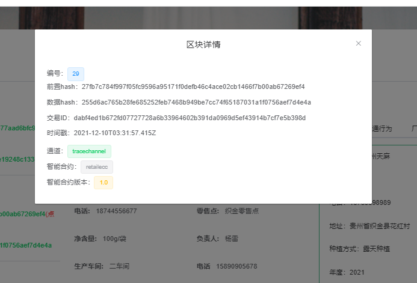

*一物一码商业版购买或商务合作请转到 **北京引瓴数智科技有限公司** 官网进行查看*。

**官网地址**：https://www.yinlingshuzhi.com/

**一物一码体验地址**：https://demo.trace.yinlingshuzhi.com/

# 基于Fabric的农产品溯源系统  

>让人类餐桌上的食物回归到农耕时代！

# 介绍

随着社会的不断发展，科技的不断进步，到了今天，你是否还记得故乡地里的那片只施农家肥的菜园，在小时候，物质虽然相对贫乏，但是吃到的
每一口在长大后再也没吃过那么香的，如今，为了生活，离开深爱的故乡，蜗居在城市的钢筋混泥土下，你是否会偶尔回味起哪些遗失的味道。

基于区块链的农产品溯源系统，分为pc端，h5端，一共分为五个组织节点，农户，原料厂商，生产厂商，物流厂商，零售商，在全流程走完后，消费者买到产品后，可对其
进行溯源，每个环节的数据都会进行上链，所以整个过程是透明的。  

本系统提供的是一种区块链应用的思想，因为在大部分人的认知里，区块链只是就是比特币，就是割韭菜，其实这是不对的，区块链使用到传统行业中，可能会有颠覆性的
作用，比如农产品，供应链溯源，电子存证，司法行业，金融行业，实物赋能，教育档案管理，医疗，公证等等场景和行业中，区块链都有其天然优势，其不可篡改，去中心化，
分布式，可追溯等特性，能在很多场景发挥作用。  

### 组织架构图


# 系统模块和技术  

此系统有四个模块， blockchain-trace-bcnetwork ，blockchain-trace-applets ，blockchain-trace-pc ，blockchain-trace-basic-data，
本系统只做了一个数据上链的操作，比较简单，因为技术其实我们都是能想办法去实现的，但是产品思维是很珍贵的，能对在相应的场景中想到相应的解决方案也是比较难的，
有了想法后，再去深入一步看细节，比如农户，原料厂商这些节点应该都是可伸缩的，可以动态的加入节点，踢出节点，而且还应该对他们有一点的奖惩机制，比如信誉到达一个
值，该踢出就踢出，还有数据上链应该采取什么方法，每个操作都上链，那么就会导致链很庞大，不每个操作都上，那么可信度又怎么解决，环节又该怎么设计，是动态添加环节，
还是直接定制，这些都是需要我们去思考的。  

    blockchain-trace-bcnetwork：区块链网络，可直接将文件上传至服务器，然后启动里面的脚本

    blockchain-trace-applets：小程序端溯源

    blockchain-trace-pc：PC端,使用的是RuoYi-Vue

    blockchain-trace-basic-data：系统基础数据后台，使用的是RuoYi

    前端：Vue.js , Element UI , mpvue

    后端：SpringBoot , Mybatis , FastDFS , Node.js , Redis , MySQL

    区块链：Fabric1.2

    智能合约：Golang

    环境：Ubuntu16.04 64位(建议2核 4G以上，2G也能运行)，Docker,  Docker-compose 

因为本系统的区块链部分是完全按照最简单的来，比如共识是自带的solo，orderer节点是单节点，这些肯定都是不合理的，所以这个版本就单纯传达一个上层应用思想吧，
后续可能会在此思想上重新搭建一套能够投入使用的。  

# 安装教程
## 一.fabric网络  
### 1.确保环境配置好  
> node.js 12

> docker

> docker-compose 

> Redis

> FastDFS

> Mysql8

> go语言环境  

### 2.拉取docker镜像  

#### pull 
``` 
docker pull hyperledger/fabric-peer:1.2.0 && 
docker pull hyperledger/fabric-orderer:1.2.0 && 
docker pull hyperledger/fabric-ca:1.2.0 && 
docker pull hyperledger/fabric-tools:1.2.0 && 
docker pull hyperledger/fabric-ccenv:1.2.0 && 
docker pull hyperledger/fabric-baseimage:0.4.10 && 
docker pull hyperledger/fabric-baseos:0.4.10 && 
docker pull hyperledger/fabric-couchdb:0.4.10
```

#### tag  
```
docker tag hyperledger/fabric-peer:1.2.0 hyperledger/fabric-peer && 
docker tag hyperledger/fabric-orderer:1.2.0 hyperledger/fabric-orderer && 
docker tag hyperledger/fabric-ca:1.2.0 hyperledger/fabric-ca && 
docker tag hyperledger/fabric-tools:1.2.0 hyperledger/fabric-tools && 
docker tag hyperledger/fabric-ccenv:1.2.0 hyperledger/fabric-ccenv && 
docker tag hyperledger/fabric-baseimage:0.4.10  hyperledger/fabric-baseimage && 
docker tag hyperledger/fabric-baseos:0.4.10 hyperledger/fabric-baseos && 
docker tag hyperledger/fabric-couchdb:0.4.10 hyperledger/fabric-couchdb 
```

### 3.上传代码到linux服务器/或者直接git拉取  
`blockchain-trace-bcnetwork`

### 4.运行basic_network目录下的start.sh文件  
> chmod -R 777 start.sh

>./start.sh 

此处会安装可能会出现问题，具体问题可以百度。

### 5.运行webapp目录下的./start.sh  
先给webapp目录下的所有sh文件授权，如下
```
chmod -R 777 startFarmerCC.sh  
```

### 6.执行npm install安装依赖  
> npm install  

可能node版本问题安装会出一些问题，node8应该是没问题的。   

### 7.注册用户
> node enrollAdmin.js  

> node registerUser.js  

执行node registerUser.js可能会安装失败，请删除一下hfc-key-store后重新执行，如果还是失败，可能就是npm install出问题，注意node版本，使用node12

### 8.启动node服务(node服务就是一个中间件，连接前端和fabric网络)  
> node app.js  

如果需要让其常驻后台，需要安装pm2。
> 启动：pm2 start app.js

> 停止：pm2 stop app.js  

到这里，区块链网络就部署完成  

## 二.系统基础数据后台blockchain-trace-basic-data，是一个SpringBoot项目  

### 1.修改application.yml文件中的Redis地址和fastdfs地址  
```yaml
  # redis 配置
  redis:
    # 地址
    host: 127.0.0.1
    # 端口，默认为6379
    port: 6379
    # 密码
    password: 

  fdfs:
      so-timeout: 1501
      connect-timeout: 601
      thumb-image:
        width: 60
        height: 60
      tracker-list: 127.0.0.1:22122
      address: http://127.0.0.1:8888/
```
### 2.修改application-druid.yml文件中mysql地址  
```yaml
# 数据源配置
spring:
    datasource:
        type: com.alibaba.druid.pool.DruidDataSource
        driverClassName: com.mysql.cj.jdbc.Driver
        druid:
            # 主库数据源
            master:
                url: jdbc:mysql://127.0.0.1:3306/blockchain?useUnicode=true&characterEncoding=utf8&zeroDateTimeBehavior=convertToNull&useSSL=true&serverTimezone=GMT%2B8
                username: root
                password: root
```

## 三.PC端（blockchain-trace-pc） 

### 1.安装依赖  
> npm install --registry=https://registry.npm.taobao.org

### 2.修改连接区块链网络地址
main.js，ip地址修改为区块链网络所在服务器地址  
```yaml
Vue.prototype.$httpUrl = "http://localhost:8080/route";
```
### 3.启动项目  
> npm run dev  


## 四.小程序（blockchain-trace-applets）
自己使用开发者工具打开


    
## 界面
### 区块链浏览器
这是调用fabric的api进行展示的，fabric生态里面国人贡献了一个fabric浏览器项目，可以去使用，不过都是调用fabric的api。
<table>
    <tr>
        <td></td>
        <td></td>
    </tr>
</table>


### 添加农作物
这里是添加农作物部分，对于像农作物，肯定是一块一块的，所以在实际中，如果需要做农作物溯源的解决方案，那么我们可能需要对地块进行规划，然后借助物联网设备，传递地块指标数据和农作物情况。
<table>
    <tr>
        <td></td>
        <td></td>
    </tr>
</table>


### 农作物种植过程记录
种植过程十分关键，它能清晰展示农作物的生长过程，生长环境，这样有利于提高可行度，消费者也可以实地进行查看一些信息。

<table>
    <tr>
        <td></td>
        <td></td>
    </tr>
</table>

### 物流追踪
只是模拟了现实场景，实际生产中，你的产品到了什么地方，这些数据都要进行上传，就像你网上购物，它的轨迹能够看到。
<table>
    <tr>
        <td></td>
        <td></td>
         <td></td>
    </tr>
</table>


### 原料厂商质检
对原材料进行质检，当农作物被原料厂商收回来后，需要对原材料进行质检，防止原材料的伪劣，这里需要介入有关部门和检测机构，保证原材料的质量，这样才能生产出号的产品。


### 生产厂商部分截图
生产厂商这里就是对原材料加工，生产成产品，这里面包括产品信息上链，加工过程上链，为什么要详细到谁加工，因为只有追溯到人，事的身上，
才能保证真实可靠，并且如果真的出现问题，也好追踪溯源，我觉得这也正是品牌的竞争力，当然，还有许多信息需要我们去扩展。
<table>
    <tr>
        <td></td>
        <td></td>
         <td></td>
    </tr>
     <tr>
        <td></td>
        <td></td>
         <td></td>
    </tr>
</table>


### 零售商
零售商这里主要就是签收产品，生成产品溯源ID，二维码可以自己去扩展，很简单。


### pc溯源
<table>
    <tr>
        <td></td>
        <td></td>
         <td></td>
    </tr>
</table>


### 小程序端溯源
>  输入ID去溯源实际上不合理，应该扫码跳到小程序里面去，如果真的要做一个农产品品牌，那必须得有一个认证的小程序，消费者可以溯源，评价，上面还应该提供一些其他的功能。

<table>
    <tr>
        <td></td>
        <td></td>
         <td></td>
    </tr>
    <tr>
        <td></td>
        <td></td>
         <td></td>
    </tr>
</table>


## 申明

此项目可以作为课程设计，毕业设计，无任何限制。

不可进行源码售卖(例如淘宝，csdn，咸鱼等平台售卖源码)，不可用于参加竞赛(若有需，请联系本人)。

### 公众号
  
